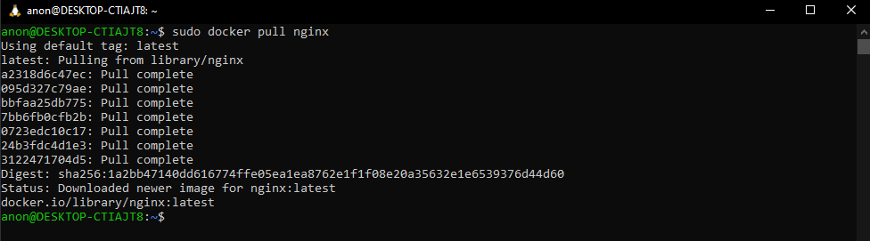
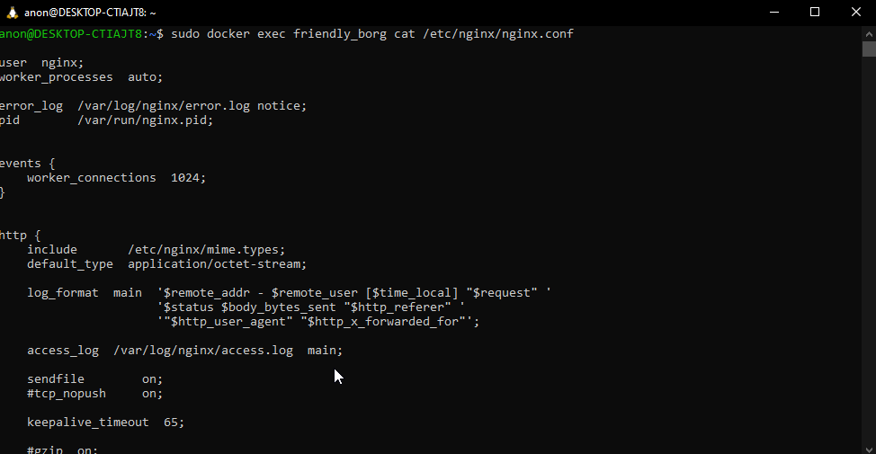
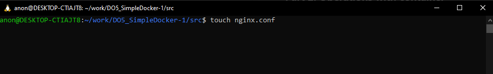
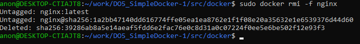

## Part 1. Ready-made docker

### Пуллим образ контейнера `nginx`

### Проверяем чтобы образ точно установился

### Запускаем контейнер

### Проверяем что контейнер работает

### Результат работы `docker inspect`

* `Размер контейнера` - `187707974` байт
* `Замапленные порты` - `:80` на `:80`
* `Айпи контейнера` - `172.17.0.2`

### Останавливаем работающий контейнер

### Проверяем что контейнер действительно остановился

### Запускаем контейнер снова с замапленными портами `80` и `443`

### Заходим на `localhost:80`

### Перезапускаем контейнер командой `docker restart`

### Проверяем что контейнер работает

## Part 2. Operations with container

### Читаем конфигурацию `nginx.conf` внутри контейнера

### Создаем конфигурацию `nginx.conf` на локальной машине и настраиваем её на показ `/status`

### Локально проверяем работу конфигурации, заходим на `localhost:80/status`

### Копируем конфигурацию в docker контейнер и перезапускаем nginx внутри него

### Проверяем localhost/status

### Экспортируем контейнер

### Останавливаем контейнер

### Удаляем образ контейнера nginx с флагом `-f`

### Удаляем контейнер

### Импортируем контейнер обратно

### Запускаем импортированный контейнер

### Проверяем что контейнер работает

## Part 3. Mini web server

### Пишем небольшой сервер с FCGI который будет возвращать нам Hello World

### Вносим необходимые правки в конфигурацию nginx и меняем её

### Перезапускаем nginx и запускаем сервер через `spawn-fcgi`

### Заходим на `localhost:81` и проверяем результат

### Перемещаем nginx.conf в `./nginx/nginx.conf`

## Part 4. Your own docker

### Пишем `build.sh` который на моменте сборки будет подготавливать контейнер к работе и компилировать сервер внутри него

### Dockerfile для сборки контейнера:

### Запускаем сборку с именем и тегом

### Проверяем что образ успешно сбилдился

### Создаем и запускаем контейнер с пробросом порта 81 на наш 80

### Проверяем localhost:80

### В конфиге nginx контейнера уже есть проксирование на /status, но бросим его туда еще раз, как и говорит задание

### Перезапускаем контейнер

### Проверяем `localhost:80/status`

## Part 5. Dockle

### Тестово запускаем dockly на текущей версии контейнера

### Меняем конфигурацию `dockerfile`:

### Билдим с `DOCKER_CONTENT_TRUST=1`

### Проверяем что контейнер успешно собрался

### Проверяем контейнер через `dockle`

### Запускаем контейнер

### Проверяем localhost:80

**Что было сделано:**

* Смена основого пользователя контейнера на с `root` на `nginx` с добавлением всех необходимых для работы nginx и fcgi прав пользователю.
* Добавление `healthcheck` для проверки работоспособности контейнера, основывающегося на проверке работоспособности процесса `spawn-fcgi`
* Добавление флага `-ak` (acknowledge keys) для  `NGINX_GPGKEYS` `NGINX_GPGKEY_PATH`, которые являются переменными инит-скрипта для официального контейнера nginx на основе которого работает мой. Эти переменные хранят в себе публичные ключи для проверки подписи образов nginx и их наличие в контейнере не является угрозой безопасности.
* Добавление env-переменной `DOCKER_CONTENT_TRUST=1` при сборке и проверке образа.
* Удаление `setuid` и `setgid` разрешений для служебных файлов.
* Смена тега образа c `latest` на `v1` при сборке образа.

## Part 6. Basic Docker Compose

### Пишем `docker-compose.yml`

### Создаем дополнительный конфиг для шлюза (`nginx`)

### Собираем получившуюся вундервафлю через `docker-compose build`

### Останавливаем все работающие контейнеры

### Запускаем через `docker-compose up`

### Заходим на `localhost:80`

